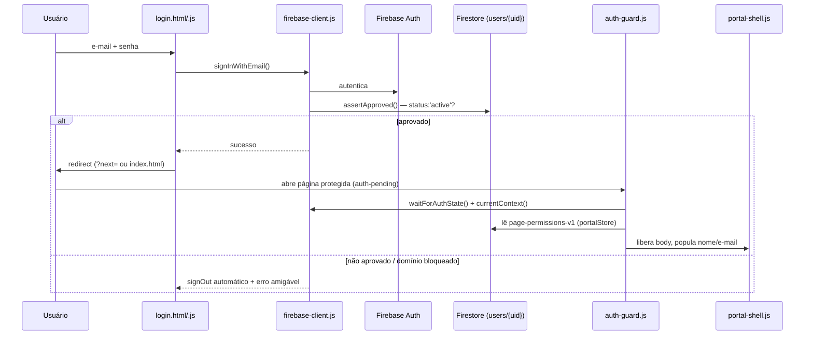
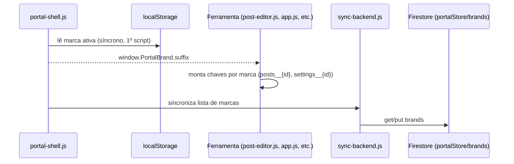
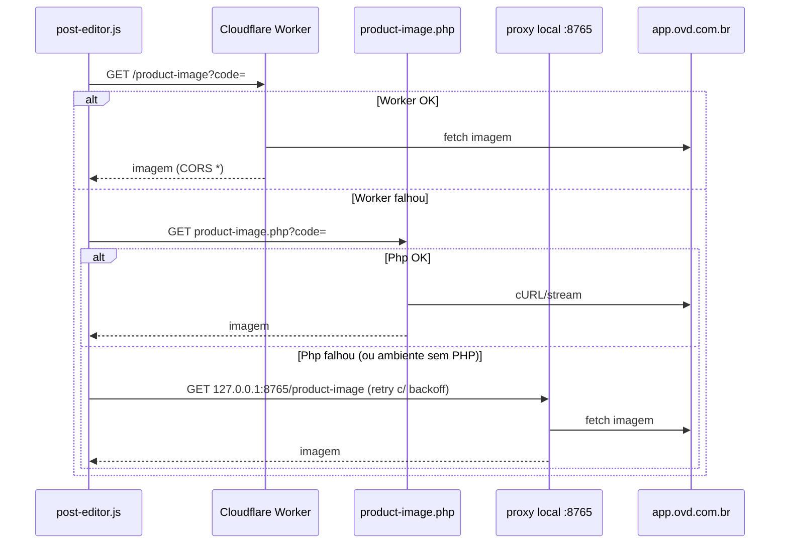
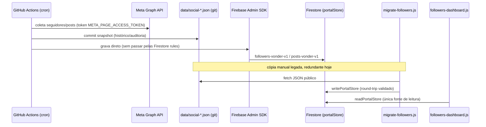

# Codebase Map

> Auto-gerado pelo Cartographer. Última mapeamento: 2026-09-09T12:10:15Z
>
> **Nota sobre o volume:** dos ~9,6M tokens escaneados, ~9,3M (765 arquivos) estão em `post-editor-assets/brands-js/*.js` e nos arquivos `business-card-*-assets.js` / `business-card-print-profile.js` — dados gerados (logos em data:URI, coordenadas de layout, perfil de impressão ICC), não lógica de aplicação. O código-fonte real do portal é **63 arquivos / ~295k tokens**. Este mapa cobre o código real em detalhe e trata os arquivos de asset como dados opacos.

## System Overview

```mermaid
graph TB
    subgraph Cliente["Navegador (estático, sem build step)"]
        Shell[portal-shell.js<br/>sidebar + marca ativa]
        Cal[visual-editor.html + app.js<br/>Calendário de Postagens]
        Editor[post-editor.html + post-editor.js<br/>Editor de Posts/Artes]
        Cartao[business-card-generator.html/.js<br/>Cartões de visita]
        Followers[followers-dashboard.html/.js<br/>Dashboard de seguidores]
        Intel[intelligence-center.html<br/>intelligence-data.js<br/>Central de Inteligência]
        Admin[admin-users.html/.js<br/>Usuários e permissões]
    end

    subgraph Auth["Autenticação"]
        Login[login.html/.js]
        Guard[auth-guard.js]
        FBClient[firebase-client.js]
    end

    subgraph Firebase["Firebase (Auth + Firestore)"]
        FireAuth[(Firebase Auth)]
        FireStore[(Firestore: users, portalStore, securityAudit)]
    end

    subgraph Backend["Backend alternativo (contingência)"]
        SyncBE[sync-backend.js]
        ApiPhp[api.php + SQLite]
    end

    subgraph Proxies["Proxies de imagem/oferta (3 implementações redundantes)"]
        Worker[Cloudflare Worker<br/>ecommerce-fg.vonderferramentas.workers.dev]
        PhpProxy[product-image.php]
        LocalProxy[product-image-proxy.ps1 + fg-offer-proxy.ps1<br/>127.0.0.1:8765/8766]
    end

    subgraph Externo["Serviços externos"]
        MetaAPI[Meta Graph API<br/>Instagram VONDER]
        OvdFotos[app.ovd.com.br/fotos/produto]
        FgSite[fg.com.br]
    end

    subgraph CI["GitHub Actions (cron)"]
        WFFollowers[sync-meta-followers.yml]
        WFPosts[sync-meta-posts.yml]
        WFHist[reconstruir-historico.yml]
        WFDocs[validar-documentacao-arquitetura.yml]
    end

    Login --> FBClient --> FireAuth
    Guard --> FBClient
    Shell --> Guard
    Cal --> Shell
    Editor --> Shell
    Cartao --> Shell
    Followers --> Shell
    Intel --> Shell
    Admin --> Shell

    Shell -->|marca ativa, localStorage| SyncBE
    SyncBE --> FBClient --> FireStore
    SyncBE -.fallback nao usado hoje.-> ApiPhp

    Intel --> SyncBE
    Followers --> FBClient
    Admin --> FBClient

    Editor --> Worker
    Editor --> PhpProxy
    Editor --> LocalProxy
    Worker --> OvdFotos
    Worker --> FgSite
    PhpProxy --> OvdFotos
    LocalProxy --> OvdFotos
    LocalProxy --> FgSite

    WFFollowers --> MetaAPI
    WFPosts --> MetaAPI
    WFHist --> MetaAPI
    WFFollowers -->|Admin SDK direto| FireStore
    WFPosts -->|Admin SDK direto| FireStore
    WFDocs -.valida PR.-> CI

    Cartao -.100% local, sem rede.- Cartao
```



## Directory Structure

```
/ (raiz — páginas e módulos do portal, tudo estático)
├── index.html / index.js / index.css          Home (seletor de marca)
├── login.html / login.js / home-auth.js        Login e sessão
├── auth-guard.js / auth.css                    Gate de autenticação (todas as páginas)
├── portal-shell.js                             Sidebar + marca ativa (1º script de toda página)
├── firebase-client.js / firebase-config.js     Camada Firebase (Auth + Firestore)
├── firestore.rules                             Regras de segurança Firestore
├── sync-backend.js / api.php                   Sync alternativo (SQLite, hoje em desuso)
├── mouse-light.js / catalog-provider.js        Utilitários (efeito visual / catálogo)
├── admin-users.html / admin-users.js           Administração de usuários/perfis
├── migrate-followers.html / .js                Migração pontual JSON→Firestore
├── visual-editor.html                          Calendário de Postagens (app.js, não lido em detalhe)
├── post-editor.html / post-editor.js           Editor de Artes (Feed/Story)
├── post-editor-fg-*.js, post-editor-*-datas-comemorativas.js   Presets de arte por marca
├── post-editor-assets/                         Assets de logo/preset por marca (gerado, ~9,3M tokens)
├── business-card-generator.html/.js/.css       Gerador de cartão de visita (100% client-side)
├── business-card-*-assets.js, business-card-print-profile.js   Assets do cartão (gerado)
├── followers-dashboard.html / .js              Dashboard de seguidores/posts (só VONDER)
├── intelligence-center.html / .js              Central de Inteligência (UI)
├── intelligence-data.js                        Motor heurístico de "DNA de editoria"
├── styles.css                                  Design system global (tema claro/escuro)
├── import-legacy-calendar.html                 Ferramenta one-off de importação de planilha
├── _pilar-*.html                                Harnesses de QA visual (screenshot headless), não são páginas do produto
├── cloudflare-worker.js                        Worker (proxy CORS: fotos + scraping oferta FG)
├── product-image.php / product-image-proxy.ps1 / fg-offer-proxy.ps1   Implementações redundantes do mesmo proxy
├── "Abrir Calendario.cmd"                       Launcher local (sobe os proxies PS1 + abre index.html)
├── data/
│   ├── social-posts.json                       Snapshot CI (auditoria; consumidor real é o Firestore)
│   ├── social-followers.json                   Histórico diário/mensal de seguidores (snapshot CI)
│   ├── social-followers-live.json               Snapshot "agora" (snapshot CI)
│   └── catalog-vonder.backup-*.json             Backup pontual do catálogo (não referenciado em código)
├── calendar-recovery-*.json                     Backup forense manual (localStorage), não referenciado em código
├── .github/workflows/                           Automação Meta/Instagram + validação de docs de arquitetura
├── docs/ARQUITETURA-E-INTEGRACOES.md            Fonte de verdade de arquitetura/integrações (mantido manualmente)
└── AGENTS.md                                    Guia de manutenção para agentes de IA (Ponytail + doc de arquitetura)
```

## Module Guide

### Portal shell, autenticação e infraestrutura

**Propósito**: casca comum (sidebar, tema, marca ativa), login/sessão e camada de dados Firebase usada por todas as ferramentas.

| Arquivo | Papel | Tokens |
|---|---|---|
| `portal-shell.js` | Sidebar, `window.PortalBrand` (marca ativa), `window.PortalNavItems`, tema | 14929 |
| `auth-guard.js` | Gate de autenticação (module) — roda em toda página protegida | 979 |
| `firebase-client.js` | Única camada de acesso a Auth + Firestore (`portalStore`) | 1167 |
| `firebase-config.js` | Config pública do Firebase Web + domínios de e-mail permitidos | 232 |
| `firestore.rules` | Regras de segurança server-side do Firestore | 248 |
| `login.html` / `login.js` / `home-auth.js` | Fluxo de login e sessão | 688 / 666 / 248 |
| `admin-users.html` / `admin-users.js` | CRUD de usuários e perfis/permissões | 858 / 8054 |
| `sync-backend.js` / `api.php` | Sync alternativo (`portalStore` via SQLite) — hoje não é o backend ativo | 152 / 1387 |
| `mouse-light.js` | Efeito visual decorativo (halo no cursor) | 1305 |
| `catalog-provider.js` | Carregamento único de catálogo de produtos por marca | 1062 |

**Exports/pontos de entrada principais**: `window.PortalBrand`, `window.PortalNavItems` (`portal-shell.js`); `window.PortalFirebase` = `{signInWithEmail, signInWithGoogle, requestPasswordReset, logout, currentContext, waitForAuthState, readPortalStore, writePortalStore, audit}` (`firebase-client.js`); `window.SyncBackend = {get, put}` (`sync-backend.js`); `window.CatalogProvider.load(slug)` (`catalog-provider.js`).

**Dependências externas**: Firebase (Auth + Firestore, plano Spark — sem Cloud Functions), Google Fonts, CDN `animejs` (mouse-light).

**Gotchas críticos**:
- `firestore.rules` libera **qualquer usuário ativo** (não só admin) para ler/escrever qualquer documento em `portalStore` — inclusive dados de seguidores/posts e a lista de permissões por página. A restrição de telas como `migrate-followers.html`/`admin-users.html` a admins é só client-side (`data-auth-role`), não reforçada nas regras.
- `apiKey`/config do Firebase Web em `firebase-config.js` é pública por natureza do SDK, mas não deve nunca ganhar companhia de uma chave de conta de serviço — isso fica só em GitHub Actions Secrets (`FIREBASE_SERVICE_ACCOUNT_KEY`).
- `.gitignore` exclui explicitamente `.env*`, `*.key`, `*.pem`, `*.sqlite*`.
- Sessão usa `browserSessionPersistence` (não sobrevive a fechar o navegador) — decisão deliberada, documentada como correção histórica.
- `api.php`/SQLite é contingência documentada, não o caminho ativo (`SyncBackend` fala com Firebase).

### Editor de Posts / Calendário (produção de artes)

**Propósito**: `visual-editor.html` (app.js) é o **planejamento** (calendário de cards por data/canal/briefing); `post-editor.html` (post-editor.js) é a **produção de arte** (Feed 1080×1350 / Story 1080×1920), com handoff via query string (`eventTitle`, `eventDay`, etc.).

| Arquivo | Papel | Tokens |
|---|---|---|
| `post-editor.js` | Motor de desenho em canvas, fluxo de 3 etapas, exportação JPG/ZIP | 19991 |
| `post-editor.html` / `.css` | Shell e estilos do editor | 4753 / 6422 |
| `post-editor-fg-ecommerce.js` | Preset "Post E-commerce" (FG) — caixa De/Por/Desconto | 3896 |
| `post-editor-fg-lancamentos.js` | Preset "Lançamentos" (FG) | 1781 |
| `post-editor-osten-datas-comemorativas.js` | Preset "Datas comemorativas" (OSTEN) | 1845 |
| `post-editor-dismatal-datas-comemorativas.js` | Preset "Datas comemorativas" (DISMATAL) | 1982 |
| `post-editor-dwt-datas-comemorativas.js` | Preset "Datas comemorativas" (DWT) | 1486 |
| `import-legacy-calendar.html` | Importação one-off de planilha para o calendário VONDER | 1996 |
| `_pilar-diagram-check.html`, `_pilar-diagram-normal-check.html`, `_pilar-card-preview.html` | Harnesses de QA visual (screenshot headless) do cartão PILAR TECNOLOGIA | ~10081 |
| `visual-editor.html` | Shell do calendário (lógica em `app.js`, fora do escopo deste mapeamento) | 14257 |
| `data/social-posts.json` | Snapshot CI de posts Instagram (auditoria; consumo real é Firestore) | 19326 |
| `calendar-recovery-20260821-1032.json` | Backup forense manual (localStorage), não referenciado em código | 8698 |
| `data/catalog-vonder.backup-20260825.json` | Backup pontual do catálogo (não referenciado em código) | 4117 |

**Como se conecta**: cada `post-editor-*.js` se auto-registra em `window.POST_EDITOR_CUSTOM_PRESETS[marca][editoria]` (ordem de `<script>` no HTML é crítica — presets antes de `post-editor.js`). `post-editor.js` lê `CatalogProvider.load(slug)` para o catálogo de produtos e resolve fotos via cascata: Cloudflare Worker → `product-image.php` → proxy local `127.0.0.1:8765`.

**Gotchas críticos**:
- Cada preset de marca é um "clone" deliberadamente isolado — nenhum código, cor ou asset é compartilhado entre marcas; um bug corrigido numa marca não se propaga para as outras.
- `data/social-posts.json`, `calendar-recovery-*.json` e `catalog-vonder.backup-*.json` **não são dados ativos** — não têm nenhuma referência em código; são snapshot/auditoria ou backup manual parado no repo. Não confundir com `data/catalog-vonder.json` (arquivo real, ~330x maior).
- Arquivos `_pilar-*.html` têm prefixo `_` por convenção do repo para "não é página do produto" — removem o gate de autenticação de propósito para permitir screenshot headless.

### Cartão de Visita, Dashboard de Seguidores e Central de Inteligência

| Arquivo | Papel | Tokens |
|---|---|---|
| `business-card-generator.js` | Motor completo: import planilha → editar → revisar → exportar PDF CMYK | 33924 |
| `business-card-generator.css` / `.html` | Estilos e shell | 5994 / 3288 |
| `followers-dashboard.js` / `.html` | Analytics de seguidores/posts (só VONDER tem integração) | 18824 / 13876 |
| `intelligence-center.js` / `.html` | UI da Central de Inteligência (biblioteca de editorias + DNA) | 10181 / 3267 |
| `intelligence-data.js` | Modelo de dados + motor heurístico de "DNA de editoria" (sem IA/LLM real) | 11856 |
| `data/social-followers.json` / `social-followers-live.json` | Snapshots CI de seguidores (histórico e "agora") | 3992 / 84 |
| `styles.css` | Design system global (tokens de tema, shell de navegação) — carregado por **todas** as páginas | 23804 |

**Gerador de cartão de visita**: 100% client-side e offline — sem Firebase, sem backend. Dados entram por upload de planilha (`vendor/xlsx.full.min.js`) ou formulário manual, ficam só em `localStorage` (`business_card_generator_v1__<marca>`, nunca sincroniza com servidor). Um desenhista de canvas por marca (`drawFg`, `drawVonder`, `drawOsten`, `drawOvd`, `drawPilar`) replica pixel-a-pixel referências de CorelDRAW/Illustrator originais (referência histórica só — a exportação final monta o PDF CMYK manualmente, sem CorelDRAW nem processo server-side). PDFs referência do CorelDRAW ficam fora do repo, em `X:\temporario\Lucas\...\OVD\` (ver memória do projeto).

**Dashboard de seguidores vs. Central de Inteligência**: são ferramentas **não relacionadas**. O dashboard lê exclusivamente do Firestore (`portalStore/followers-vonder-v1`, `posts-vonder-v1`) — nunca dos JSONs em `data/` diretamente; uma migração manual (`migrate-followers.js`) precisa copiar os JSONs publicados pelo CI para o Firestore antes do dashboard refletir dados novos. A Central de Inteligência gera um "DNA" por editoria (objetivo/público/tom/estratégia) via heurística de texto/imagem 100% local, consumido depois pelo calendário (`app.js`) para sugerir/validar posts — sem ligação com seguidores/analytics.

**`isVonder` (`followers-dashboard.js`)** está hard-coded ao id de marca `'default'` — é o mecanismo real do "isolamento de marcas nas redes sociais" (só VONDER vê dados reais; demais marcas veem "não conectado").

### Proxies de imagem/oferta (triplicados)

Três implementações independentes do mesmo contrato (`?code=&w=` para foto de produto; `?url=` para scraping de oferta FG), sem código compartilhado entre si:

| Implementação | Ambiente | Porta/rota |
|---|---|---|
| `cloudflare-worker.js` | Produção | `ecommerce-fg.vonderferramentas.workers.dev/product-image` e `/product-offer` |
| `product-image.php` | Hospedagem PHP própria (fallback) | mesma rota, via cURL/GD |
| `product-image-proxy.ps1` + `fg-offer-proxy.ps1` | Local/offline (`Abrir Calendario.cmd`) | `127.0.0.1:8765` / `:8766` |

Upstream real das fotos: `app.ovd.com.br/fotos/produto`. Upstream de oferta: `fg.com.br` (parser de objeto `skuJson_0` embutido no HTML, duplicado em JS e PowerShell).

### CI/CD — GitHub Actions (`.github/workflows/`)

Todos usam o secret `META_PAGE_ACCESS_TOKEN` contra a Meta Graph API v26.0 para a conta Instagram fixa da VONDER (única marca com coleta automática).

| Workflow | Gatilho | Faz |
|---|---|---|
| `sync-meta-followers.yml` | cron 15min + 23:55 fechamento + manual | Snapshot live + histórico diário; grava direto no Firestore via Admin SDK (`FIREBASE_SERVICE_ACCOUNT_KEY`) |
| `sync-meta-posts.yml` | cron 6h + manual | Snapshot de posts + insights; grava no Firestore via Admin SDK |
| `reconstruir-historico.yml` | cron diário (após coleta) + manual | Reconstrói histórico retroativo com conferência cruzada (rejeita se divergência >15%) |
| `diagnostico-meta.yml` / `diagnostico-meta-posts.yml` | manual | Sondagem de escopos/métricas disponíveis na API (não grava nada) |
| `validar-documentacao-arquitetura.yml` | PR/push | Falha o check se arquivo de integração mudou sem `docs/ARQUITETURA-E-INTEGRACOES.md` mudar junto |

**Gotcha**: sem `FIREBASE_SERVICE_ACCOUNT_KEY`, os workflows de sync emitem só `::warning::` e não falham — o painel fica "desatualizado" silenciosamente.

## Data Flow

### Autenticação (toda página protegida)



### Isolamento de marca



### Produção de arte com foto de produto (cascata de proxy)



### Pipeline de seguidores/posts (Instagram → Firestore → Dashboard)



## Conventions

- **Sem framework/bundler**: tudo `<script>` clássico + alguns `type="module"`; ordem de carregamento no HTML é significativa e frequentemente crítica (presets antes do motor que os consome, dados antes da UI).
- **Isolamento por marca via sufixo**: `window.PortalBrand.suffix` (de `portal-shell.js`) sufixa chaves de `localStorage` e do Firestore/`api.php` em quase todo módulo (`calendar_settings_v1<suffix>`, `posts<suffix>`, `intel<suffix>`, `business_card_generator_v1__<brandId>`).
- **Concorrência otimista replicada em 3 lugares**: Firestore (`runTransaction` comparando `updated_at`), `api.php`/SQLite (`expected_updated_at` → 409) e a lógica de sync do front — todas seguem o mesmo protocolo de versão.
- **Duplicação deliberada por marca**: presets de arte (`post-editor-*.js`) e desenhistas de cartão (`drawFg`/`drawVonder`/`drawOsten`/...) são clones isolados de propósito — nunca compartilham função/cor/asset entre marcas, para não vazar mudança de uma marca para outra.
- **`[hidden]` vs `display`**: convenção repetida (e documentada) de que `[hidden]{display:none!important}` precisa ser reforçado onde o elemento também tem `display:flex/grid` — bug histórico já corrigido mais de uma vez.
- **`SYNC_ENABLED = location.protocol !== 'file:'`**: padrão repetido — sob `file://` (abrir HTML direto), sync com servidor desliga silenciosamente.
- **Comentários em pt-BR explicando o "porquê"**, não o "o quê" — geometria de canvas, decisões de fuso/UTC, limites de heurística.
- **Prefixo `_` no nome do arquivo** = ferramenta de debug/QA, não é página do produto (`_pilar-*.html`).

## Gotchas

- **Firestore `portalStore` é liberado a qualquer usuário ativo**, não só admin — telas "restritas a admin" (`admin-users.html`, `migrate-followers.html`) só bloqueiam no client, não nas regras.
- **`isVonder` hard-coded** em `followers-dashboard.js` ao id `'default'` — se o id da marca VONDER mudar em `portal-shell.js`, o dashboard passa a tratar VONDER como "sem integração" silenciosamente.
- **Dashboard de seguidores nunca lê os JSONs de `data/` diretamente** — precisa da migração manual (`migrate-followers.html`) rodar depois de cada atualização do CI, senão mostra dados desatualizados.
- **Sem `FIREBASE_SERVICE_ACCOUNT_KEY`**, os workflows de sync Meta só avisam (`::warning::`) e não falham — falha silenciosa de atualização.
- **`business-card-generator.js` é 100% local** (`localStorage` por marca) — trocar de máquina/navegador perde os cartões em edição; não há backup automático.
- **Central de Inteligência não usa IA/LLM real** — o "DNA de editoria" é heurística de texto/imagem local (frequência de palavras, regex de CTA, cor média), documentado explicitamente no código para não criar expectativa errada.
- **Três implementações redundantes e não compartilhadas** do proxy de imagem/oferta (Worker, PHP, PowerShell local) — corrigir um bug de parsing (`skuJson_0`) exige repetir a correção nos três.
- **Arquivos de backup/snapshot na raiz** (`calendar-recovery-*.json`, `data/catalog-vonder.backup-*.json`, `data/social-posts.json`) não são dados ativos — nenhum tem referência em código; não confundir com os arquivos "vivos" de mesmo prefixo.

## Navigation Guide

**Para adicionar uma nova editoria/preset de arte para uma marca**: criar `post-editor-<marca>-<editoria>.js` seguindo o padrão dos existentes (registrar em `window.POST_EDITOR_CUSTOM_PRESETS`), incluir o `<script>` em `post-editor.html` **antes** de `post-editor.js`, e registrar o preset como isolado (não reusar função de outra marca).

**Para investigar por que o Dashboard de Seguidores não atualiza**: verificar se `migrate-followers.html` foi executado após a última atualização de `data/social-followers*.json` pelo GitHub Actions; conferir se o secret `FIREBASE_SERVICE_ACCOUNT_KEY` está configurado (senão os workflows só avisam, não falham).

**Para alterar regras de acesso por perfil**: `admin-users.html`/`.js` (UI) grava em `portalStore/page-permissions-v1`; `auth-guard.js` é quem de fato aplica isso escondendo itens do menu — lembrar que as `firestore.rules` **não** reforçam essa granularidade (qualquer usuário ativo pode escrever em `portalStore` diretamente).

**Para adicionar/trocar o proxy de imagem de produto**: replicar a mudança nos três locais (`cloudflare-worker.js`, `product-image.php`, `product-image-proxy.ps1`) — não há código compartilhado entre eles.

**Para investigar segredos/integrações**: consultar `docs/ARQUITETURA-E-INTEGRACOES.md` (fonte de verdade mantida manualmente) — toda mudança de integração externa deve atualizar esse arquivo na mesma alteração (reforçado por `validar-documentacao-arquitetura.yml`).

**Para o gerador de cartão de visita**: fluxo é `business-card-generator.html` → `business-card-generator.js` (import planilha/manual → editar → revisar → exportar PDF); referências visuais originais (CorelDRAW/PDF) ficam fora do repo — ver `docs/ARQUITETURA-E-INTEGRACOES.md` e memória do projeto para o caminho de rede.
