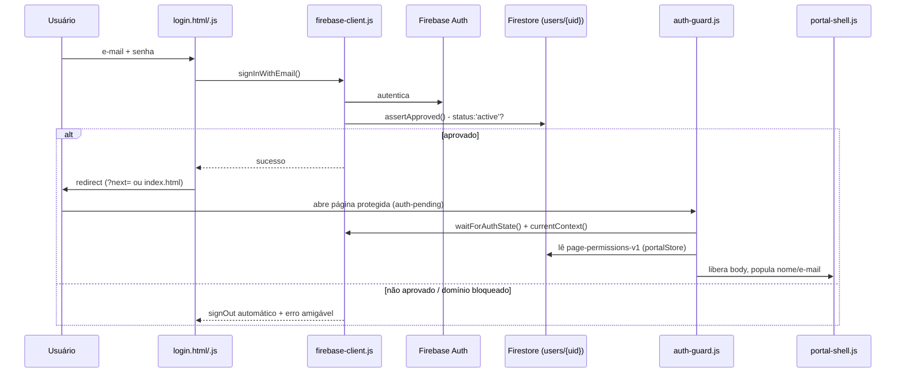
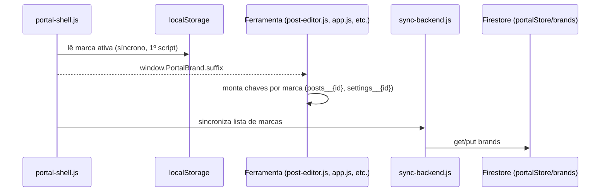
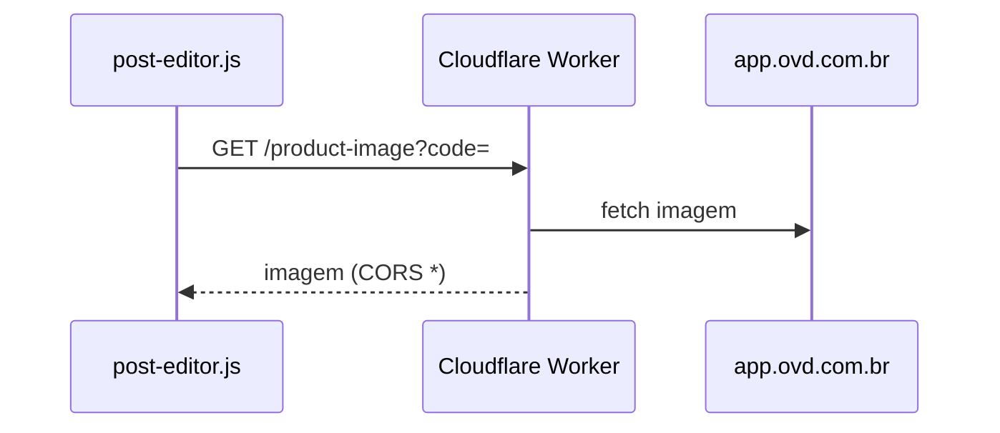
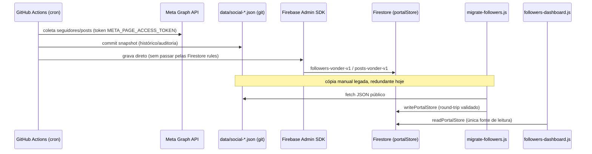

# Codebase Map

> Auto-gerado pelo Cartographer. Última mapeamento: 2026-09-09T12:10:15Z
>
> **Nota sobre o volume:** dos ~9,6M tokens escaneados, ~9,3M (765 arquivos) estão em `post-editor-assets/brands-js/*.js` e nos arquivos `business-card-*-assets.js` / `business-card-print-profile.js` - dados gerados (logos em data:URI, coordenadas de layout, perfil de impressão ICC), não lógica de aplicação. O código-fonte real do portal é **63 arquivos / ~295k tokens**. Este mapa cobre o código real em detalhe e trata os arquivos de asset como dados opacos.

## System Overview


```mermaid
graph TB
    subgraph Cliente["Navegador (estático, sem build step)"]
        Shell[portal-shell.js<br/>sidebar + marca ativa]
        Cal[visual-editor.html + app.js<br/>Calendário de Postagens]
        Editor[post-editor.html + post-editor.js<br/>Editor de Posts/Artes]
        Cartao[business-card-generator.html/.js<br/>Cartões de visita]
        Followers[followers-dashboard.html/.js<br/>Dashboard de seguidores]
        Intel[intelligence-center.html<br/>intelligence-data.js<br/>Central de Inteligência]
        Admin[admin-users.html/.js<br/>Usuários e permissões]
    end

    subgraph Auth["Autenticação"]
        Login[login.html/.js]
        Guard[auth-guard.js]
        FBClient[firebase-client.js]
    end

    subgraph Firebase["Firebase (Auth + Firestore)"]
        FireAuth[(Firebase Auth)]
        FireStore[(Firestore: users, portalStore, securityAudit)]
    end

    subgraph Backend["Backend alternativo (contingência)"]
        SyncBE[sync-backend.js]
        ApiPhp[api.php + SQLite]
    end

    subgraph Proxies["Proxy de imagem/oferta/catálogo"]
        Worker[Cloudflare Worker<br/>ecommerce-fg.vonderferramentas.workers.dev]
    end

    subgraph Externo["Serviços externos"]
        MetaAPI[Meta Graph API<br/>Instagram VONDER]
        OvdFotos[app.ovd.com.br/fotos/produto]
        FgSite[fg.com.br]
    end

    subgraph CI["GitHub Actions (cron)"]
        WFFollowers[sync-meta-followers.yml]
        WFPosts[sync-meta-posts.yml]
        WFHist[reconstruir-historico.yml]
        WFDocs[validar-documentacao-arquitetura.yml]
    end

    Login --> FBClient --> FireAuth
    Guard --> FBClient
    Shell --> Guard
    Cal --> Shell
    Editor --> Shell
    Cartao --> Shell
    Followers --> Shell
    Intel --> Shell
    Admin --> Shell

    Shell -->|marca ativa, localStorage| SyncBE
    SyncBE --> FBClient --> FireStore
    SyncBE -.fallback nao usado hoje.-> ApiPhp

    Intel --> SyncBE
    Followers --> FBClient
    Admin --> FBClient

    Editor --> Worker
    Editor --> PhpProxy
    Editor --> LocalProxy
    Worker --> OvdFotos
    Worker --> FgSite
    PhpProxy --> OvdFotos
    LocalProxy --> OvdFotos
    LocalProxy --> FgSite

    WFFollowers --> MetaAPI
    WFPosts --> MetaAPI
    WFHist --> MetaAPI
    WFFollowers -->|Admin SDK direto| FireStore
    WFPosts -->|Admin SDK direto| FireStore
    WFDocs -.valida PR.-> CI

    Cartao -.100% local, sem rede.- Cartao
```

## Directory Structure

```
/ (raiz - páginas e módulos do portal, tudo estático)
├── index.html / index.js / index.css          Home (seletor de marca)
├── login.html / login.js / home-auth.js        Login e sessão
├── auth-guard.js / auth.css                    Gate de autenticação (todas as páginas)
├── portal-shell.js                             Sidebar + marca ativa (1º script de toda página)
├── firebase-client.js / firebase-config.js     Camada Firebase (Auth + Firestore)
├── firestore.rules                             Regras de segurança Firestore
├── sync-backend.js / api.php                   Sync alternativo (SQLite, hoje em desuso)
├── mouse-light.js / catalog-provider.js        Utilitários (efeito visual / catálogo)
├── admin-users.html / admin-users.js           Administração de usuários/perfis
├── migrate-followers.html / .js                Migração pontual JSON→Firestore
├── visual-editor.html                          Calendário de Postagens (app.js, não lido em detalhe)
├── post-editor.html / post-editor.js           Editor de Artes (Feed/Story)
├── post-editor-fg-*.js, post-editor-*-datas-comemorativas.js   Presets de arte por marca
├── post-editor-assets/                         Assets de logo/preset por marca (gerado, ~9,3M tokens)
├── business-card-generator.html/.js/.css       Gerador de cartão de visita (100% client-side)
├── business-card-*-assets.js, business-card-print-profile.js   Assets do cartão (gerado)
├── followers-dashboard.html / .js              Dashboard de seguidores/posts (só VONDER)
├── monitoramento.html / .js                    Monitoramento de menções no YouTube (só VONDER)
├── intelligence-center.html / .js              Central de Inteligência (UI)
├── intelligence-data.js                        Motor heurístico de "DNA de editoria"
├── styles.css                                  Design system global (tema claro/escuro)
├── import-legacy-calendar.html                 Ferramenta one-off de importação de planilha
├── _pilar-*.html                                Harnesses de QA visual (screenshot headless), não são páginas do produto
├── cloudflare-worker.js                        Worker (proxy CORS: fotos + scraping oferta FG)
├── data/
│   ├── social-posts.json                       Snapshot CI (auditoria; consumidor real é o Firestore)
│   ├── social-followers.json                   Histórico diário/mensal de seguidores (snapshot CI)
│   ├── social-followers-live.json               Snapshot "agora" (snapshot CI)
│   └── catalog-vonder.backup-*.json             Backup pontual do catálogo (não referenciado em código)
├── calendar-recovery-*.json                     Backup forense manual (localStorage), não referenciado em código
├── .github/workflows/                           Automação Meta/Instagram + validação de docs de arquitetura
├── docs/ARQUITETURA-E-INTEGRACOES.md            Fonte de verdade de arquitetura/integrações (mantido manualmente)
└── AGENTS.md                                    Guia de manutenção para agentes de IA (Ponytail + doc de arquitetura)
```

## Module Guide

### Portal shell, autenticação e infraestrutura

**Propósito**: casca comum (sidebar, tema, marca ativa), login/sessão e camada de dados Firebase usada por todas as ferramentas.

| Arquivo | Papel | Tokens |
|---|---|---|
| `portal-shell.js` | Sidebar, `window.PortalBrand` (marca ativa), `window.PortalNavItems`, tema | 14929 |
| `auth-guard.js` | Gate de autenticação (module) - roda em toda página protegida | 979 |
| `firebase-client.js` | Única camada de acesso a Auth + Firestore (`portalStore`) | 1167 |
| `firebase-config.js` | Config pública do Firebase Web + domínios de e-mail permitidos | 232 |
| `firestore.rules` | Regras de segurança server-side do Firestore | 248 |
| `login.html` / `login.js` / `home-auth.js` | Fluxo de login e sessão | 688 / 666 / 248 |
| `admin-users.html` / `admin-users.js` | CRUD de usuários e perfis/permissões | 858 / 8054 |
| `sync-backend.js` / `api.php` | Sync alternativo (`portalStore` via SQLite) - hoje não é o backend ativo | 152 / 1387 |
| `mouse-light.js` | Efeito visual decorativo (halo no cursor) | 1305 |
| `catalog-provider.js` | Carregamento único de catálogo de produtos por marca | 1062 |

**Exports/pontos de entrada principais**: `window.PortalBrand`, `window.PortalNavItems` (`portal-shell.js`); `window.PortalFirebase` = `{signInWithEmail, signInWithGoogle, requestPasswordReset, logout, currentContext, waitForAuthState, readPortalStore, writePortalStore, audit}` (`firebase-client.js`); `window.SyncBackend = {get, put}` (`sync-backend.js`); `window.CatalogProvider.load(slug)` (`catalog-provider.js`).

**Dependências externas**: Firebase (Auth + Firestore, plano Spark - sem Cloud Functions), Google Fonts, CDN `animejs` (mouse-light).

**Gotchas críticos**:
- `firestore.rules` libera **qualquer usuário ativo** (não só admin) para ler/escrever a maior parte de `portalStore` (calendário, configurações). Desde 15/09/2026, dados de seguidores/posts e a lista de permissões por página (`isControlDoc`/`isCollectedDataDoc`) exigem `admin()` nas próprias regras. A restrição de telas como `migrate-followers.html`/`admin-users.html` a admins continua também client-side (`data-auth-role`), mas hoje é reforçada nas regras para esses documentos - não é mais só cosmética.
- `apiKey`/config do Firebase Web em `firebase-config.js` é pública por natureza do SDK, mas não deve nunca ganhar companhia de uma chave de conta de serviço - isso fica só em GitHub Actions Secrets (`FIREBASE_SERVICE_ACCOUNT_KEY`).
- `.gitignore` exclui explicitamente `.env*`, `*.key`, `*.pem`, `*.sqlite*`.
- Sessão usa `browserSessionPersistence` (não sobrevive a fechar o navegador) - decisão deliberada, documentada como correção histórica.
- `api.php`/SQLite é contingência documentada, não o caminho ativo (`SyncBackend` fala com Firebase).

### Editor de Posts / Calendário (produção de artes)

**Propósito**: `visual-editor.html` (app.js) é o **planejamento** (calendário de cards por data/canal/briefing); `post-editor.html` (post-editor.js) é a **produção de arte** (Feed 1080×1350 / Story 1080×1920), com handoff via query string (`eventTitle`, `eventDay`, etc.).

| Arquivo | Papel | Tokens |
|---|---|---|
| `post-editor.js` | Motor de desenho em canvas, fluxo de 3 etapas, exportação JPG/ZIP | 19991 |
| `post-editor.html` / `.css` | Shell e estilos do editor | 4753 / 6422 |
| `post-editor-fg-ecommerce.js` | Preset "Post E-commerce" (FG) - caixa De/Por/Desconto | 3896 |
| `post-editor-fg-lancamentos.js` | Preset "Lançamentos" (FG) | 1781 |
| `post-editor-vonder-uso-recomendo.js` | Preset "Uso e Recomendo VONDER" (VONDER): faixas preta/amarela, esquerda ou direita, arrastáveis na vertical | ~110 |
| `post-editor-vonder-datas-comemorativas.js` | Preset "Datas comemorativas" (VONDER): grade de 1/2/4 fotos com enquadramento e zoom por foto, losango + faixa preta com a data, forma amarela de pontas e forma branca opcional; textos editáveis por duplo clique (B/I/U e tamanho). Painel próprio (`#vcPanel`) e fonte Montserrat | ~330 |
| `post-editor-saved-arts.js` | Artes salvas: salvamento automático da receita no `portalStore` (`art-draft-*`), fotos originais no IndexedDB (hash) e cópia comprimida em `artPhotos`, bloqueio "fulano está editando", lixeira, lista e reabertura. Usa os ganchos `serialize()`/`restore()` do preset ou, nas editorias sem eles, o adaptador genérico `SAVED_ADAPTER` de `post-editor.js` | ~290 |
| `scripts/purge_art_drafts.py` + `.github/workflows/limpar-artes-salvas.yml` | Limpeza diária das artes salvas (lixeira de 7 dias, fotos sem uso, `art-stats-v1`); decisões em funções puras testadas em `tests/purge_art_drafts.test.py` | ~110 |
| `post-editor-osten-datas-comemorativas.js` | Preset "Datas comemorativas" (OSTEN) | 1845 |
| `post-editor-dismatal-datas-comemorativas.js` | Preset "Datas comemorativas" (DISMATAL) | 1982 |
| `post-editor-dwt-datas-comemorativas.js` | Preset "Datas comemorativas" (DWT) | 1486 |
| `import-legacy-calendar.html` | Importação one-off de planilha para o calendário VONDER | 1996 |
| `_pilar-diagram-check.html`, `_pilar-diagram-normal-check.html`, `_pilar-card-preview.html` | Harnesses de QA visual (screenshot headless) do cartão PILAR TECNOLOGIA | ~10081 |
| `visual-editor.html` | Shell do calendário (lógica em `app.js`, fora do escopo deste mapeamento) | 14257 |
| `data/social-posts.json` | Snapshot CI de posts Instagram (auditoria; consumo real é Firestore) | 19326 |
| `calendar-recovery-20260821-1032.json` | Backup forense manual (localStorage), não referenciado em código | 8698 |
| `data/catalog-vonder.backup-20260825.json` | Backup pontual do catálogo (não referenciado em código) | 4117 |

**Ganchos opcionais de preset** (além de `renderer`): `panel` (mostra `#vcPanel` e esconde as seções do núcleo), `setup(api)` (chamado ao escolher a editoria, recebe `incoming` do calendário), `pickTarget(format,x,y,evento)`/`onDrag(...,x,y)`/`onDragEnd` (arraste por elemento, com a posição na arte e o fim do arraste), `wheel`, `dblclick` (pode devolver `{hit,box,label}` para o quadrado amarelo de seleção), `noBackground` (sem foto de fundo única) e `verticalOnly` (destaque só anda na vertical). Só o preset VONDER de Datas comemorativas os usa por enquanto; os testes dele ficam em `tests/vonder-datas-comemorativas.test.html`.

**Como se conecta**: cada `post-editor-*.js` se auto-registra em `window.POST_EDITOR_CUSTOM_PRESETS[marca][editoria]` (ordem de `<script>` no HTML é crítica - presets antes de `post-editor.js`). `post-editor.js` lê `CatalogProvider.load(slug)` para o catálogo de produtos e resolve a foto do produto pelo Cloudflare Worker (`/product-image`), único caminho (o portal só fala com a web).

**Gotchas críticos**:
- Cada preset de marca é um "clone" deliberadamente isolado - nenhum código, cor ou asset é compartilhado entre marcas; um bug corrigido numa marca não se propaga para as outras.
- `data/social-posts.json`, `calendar-recovery-*.json` e `catalog-vonder.backup-*.json` **não são dados ativos** - não têm nenhuma referência em código; são snapshot/auditoria ou backup manual parado no repo. Não confundir com `data/catalog-vonder.json` (arquivo real, ~330x maior).
- Arquivos `_pilar-*.html` têm prefixo `_` por convenção do repo para "não é página do produto" - removem o gate de autenticação de propósito para permitir screenshot headless.

### Cartão de Visita, Dashboard de Seguidores e Central de Inteligência

| Arquivo | Papel | Tokens |
|---|---|---|
| `business-card-generator.js` | Motor completo: import planilha → editar → revisar → exportar PDF CMYK | 33924 |
| `business-card-generator.css` / `.html` | Estilos e shell | 5994 / 3288 |
| `followers-dashboard.js` / `.html` | Analytics de seguidores/posts (só VONDER tem integração) | 18824 / 13876 |
| `intelligence-center.js` / `.html` | UI da Central de Inteligência (biblioteca de editorias + DNA) | 10181 / 3267 |
| `intelligence-data.js` | Modelo de dados + motor heurístico de "DNA de editoria" (sem IA/LLM real) | 11856 |
| `data/social-followers.json` / `social-followers-live.json` | Snapshots CI de seguidores (histórico e "agora") | 3992 / 84 |
| `styles.css` | Design system global (tokens de tema, shell de navegação) - carregado por **todas** as páginas | 23804 |

**Gerador de cartão de visita**: 100% client-side e offline - sem Firebase, sem backend. Dados entram por upload de planilha (`vendor/xlsx.full.min.js`) ou formulário manual, ficam só em `localStorage` (`business_card_generator_v1__<marca>`, nunca sincroniza com servidor). Um desenhista de canvas por marca (`drawFg`, `drawVonder`, `drawOsten`, `drawOvd`, `drawPilar`) replica pixel-a-pixel referências de CorelDRAW/Illustrator originais (referência histórica só - a exportação final monta o PDF CMYK manualmente, sem CorelDRAW nem processo server-side). PDFs referência do CorelDRAW ficam fora do repo, em `X:\temporario\Lucas\...\OVD\` (ver memória do projeto).

**Dashboard de seguidores vs. Central de Inteligência**: são ferramentas **não relacionadas**. O dashboard lê exclusivamente do Firestore (`portalStore/followers-vonder-v1`, `posts-vonder-v1`) - nunca dos JSONs em `data/` diretamente; desde 09/09/2026 `sync-meta-followers.yml` já grava esse documento direto via Admin SDK a cada execução, então `migrate-followers.js` (cópia manual dos JSONs publicados pelo CI) é hoje redundante, não um passo necessário do fluxo normal (ver Gotchas). A Central de Inteligência gera um "DNA" por editoria (objetivo/público/tom/estratégia) via heurística de texto/imagem 100% local, consumido depois pelo calendário (`app.js`) para sugerir/validar posts - sem ligação com seguidores/analytics.

**Isolamento de marcas nas redes sociais (`followers-dashboard.js`)**: desde a entrada da Ferramentas Gerais (11/09/2026) quem decide isso é `BRAND_INTEGRATIONS` (mapa id-de-marca → sufixo de documento + quais redes têm coleta) - marca fora do mapa mostra "não conectado" em tudo. `isVonder` (`brandKey === 'default'`) sobrou só para decidir se a meta padrão de 1M de seguidores (`DEFAULT_GOALS`) se aplica; não é mais quem decide se uma marca vê dado real.

### Proxies de imagem/oferta (triplicados)

Três implementações independentes do mesmo contrato (`?code=&w=` para foto de produto; `?url=` para scraping de oferta FG), sem código compartilhado entre si:

| Implementação | Ambiente | Rotas |
|---|---|---|
| `cloudflare-worker.js` | Produção e HML | `ecommerce-fg.vonderferramentas.workers.dev`: `/product-image`, `/product-offer`, `/product-link`, `/product-catalog`, `/product-search`, `/product-thumbs` |

Upstream real das fotos: `app.ovd.com.br/fotos/produto`. Upstream de oferta: `fg.com.br` (parser de objeto `skuJson_0` embutido no HTML, só no Worker).

### CI/CD - GitHub Actions (`.github/workflows/`)

Todos usam o secret `META_PAGE_ACCESS_TOKEN` contra a Meta Graph API v26.0 para a conta Instagram fixa da VONDER (única marca com coleta automática).

| Workflow | Gatilho | Faz |
|---|---|---|
| `sync-meta-followers.yml` | disparo do Worker de hora em hora (`cloudflare-agendador.js`) + fechamento 23:55 SP + manual (sem cron próprio) | Snapshot live + histórico diário; grava direto no Firestore via Admin SDK (`FIREBASE_SERVICE_ACCOUNT_KEY`) |
| `sync-meta-posts.yml` | disparo do Worker de 12 em 12h + manual | Snapshot de posts + insights; grava no Firestore via Admin SDK |
| `reconstruir-historico.yml` | disparo diário do Worker (após coleta) + manual | Reconstrói histórico retroativo com conferência cruzada (rejeita se divergência >15%) |
| `cloudflare-agendador.js` (Cloudflare Worker) | Cron Trigger `*/5 * * * *` | Único disparo dos coletores (os workflows não têm cron próprio): dispara por `workflow_dispatch` os coletores de seguidores (hora em hora), as menções (2h) e os fechamentos diários, porque o `schedule` do GitHub atrasa várias horas; ver seção 23 da ARQUITETURA |
| `validar-documentacao-arquitetura.yml` | PR/push | Falha o check se arquivo de integração mudou sem `docs/ARQUITETURA-E-INTEGRACOES.md` mudar junto |
| `backup-portalstore.yml` | disparo diário do Worker 04:00 SP + manual | Despeja `portalStore`+`users` comprimido no repositório privado `portalmktovd-backups` (retenção 30 dias); **falha** (não só avisa) sem `BACKUP_REPO_TOKEN`/`FIREBASE_SERVICE_ACCOUNT_KEY` - ver `docs/ARQUITETURA-E-INTEGRACOES.md` seção 18 |
| `testes.yml` | push + pull_request | Roda os 3 testes de `tests/` - checagem estática (`.ps1`), assert (`match_trends_catalog.test.py`) e `concurrent-post-sync.html` em Chrome headless - desde 15/09/2026; antes nenhum teste deste projeto rodava sozinho, só manual |

**Gotcha**: sem `FIREBASE_SERVICE_ACCOUNT_KEY`, os workflows de *sync* emitem só `::warning::` e não falham - o painel fica "desatualizado" silenciosamente. `backup-portalstore.yml` é a exceção deliberada: como o único propósito dele é o backup, ele falha de verdade se algum dos dois secrets faltar.

## Data Flow

### Autenticação (toda página protegida)


```mermaid
sequenceDiagram
    participant U as Usuário
    participant Login as login.html/.js
    participant FB as firebase-client.js
    participant Auth as Firebase Auth
    participant FS as Firestore (users/{uid})
    participant Guard as auth-guard.js
    participant Shell as portal-shell.js

    U->>Login: e-mail + senha
    Login->>FB: signInWithEmail()
    FB->>Auth: autentica
    FB->>FS: assertApproved() - status:'active'?
    alt aprovado
        FB-->>Login: sucesso
        Login->>U: redirect (?next= ou index.html)
        U->>Guard: abre página protegida (auth-pending)
        Guard->>FB: waitForAuthState() + currentContext()
        Guard->>FS: lê page-permissions-v1 (portalStore)
        Guard->>Shell: libera body, popula nome/e-mail
    else não aprovado / domínio bloqueado
        FB-->>Login: signOut automático + erro amigável
    end
```

### Isolamento de marca


```mermaid
sequenceDiagram
    participant Shell as portal-shell.js
    participant LS as localStorage
    participant App as Ferramenta (post-editor.js, app.js, etc.)
    participant Sync as sync-backend.js
    participant FS as Firestore (portalStore/brands)

    Shell->>LS: lê marca ativa (síncrono, 1º script)
    Shell-->>App: window.PortalBrand.suffix
    App->>App: monta chaves por marca (posts__{id}, settings__{id})
    Shell->>Sync: sincroniza lista de marcas
    Sync->>FS: get/put brands
```

### Produção de arte com foto de produto


```mermaid
sequenceDiagram
    participant Editor as post-editor.js
    participant Worker as Cloudflare Worker
    participant Ovd as app.ovd.com.br

    Editor->>Worker: GET /product-image?code=
    Worker->>Ovd: fetch imagem
    Worker-->>Editor: imagem (CORS *)
```

### Pipeline de seguidores/posts (Instagram → Firestore → Dashboard)


```mermaid
sequenceDiagram
    participant CI as GitHub Actions (cron)
    participant Meta as Meta Graph API
    participant Repo as data/social-*.json (git)
    participant Admin as Firebase Admin SDK
    participant FS as Firestore (portalStore)
    participant Migrate as migrate-followers.js
    participant Dash as followers-dashboard.js

    CI->>Meta: coleta seguidores/posts (token META_PAGE_ACCESS_TOKEN)
    CI->>Repo: commit snapshot (histórico/auditoria)
    CI->>Admin: grava direto (sem passar pelas Firestore rules)
    Admin->>FS: followers-vonder-v1 / posts-vonder-v1
    Note over Migrate,Repo: cópia manual legada, redundante hoje
    Migrate->>Repo: fetch JSON público
    Migrate->>FS: writePortalStore (round-trip validado)
    Dash->>FS: readPortalStore (única fonte de leitura)
```

## Conventions

- **Sem framework/bundler**: tudo `<script>` clássico + alguns `type="module"`; ordem de carregamento no HTML é significativa e frequentemente crítica (presets antes do motor que os consome, dados antes da UI).
- **Isolamento por marca via sufixo**: `window.PortalBrand.suffix` (de `portal-shell.js`) sufixa chaves de `localStorage` e do Firestore/`api.php` em quase todo módulo (`calendar_settings_v1<suffix>`, `posts<suffix>`, `intel<suffix>`, `business_card_generator_v1__<brandId>`).
- **Concorrência otimista replicada em 3 lugares**: Firestore (`runTransaction` comparando `updated_at`), `api.php`/SQLite (`expected_updated_at` → 409) e a lógica de sync do front - todas seguem o mesmo protocolo de versão.
- **Duplicação deliberada por marca**: presets de arte (`post-editor-*.js`) e desenhistas de cartão (`drawFg`/`drawVonder`/`drawOsten`/...) são clones isolados de propósito - nunca compartilham função/cor/asset entre marcas, para não vazar mudança de uma marca para outra.
- **`[hidden]` vs `display`**: convenção repetida (e documentada) de que `[hidden]{display:none!important}` precisa ser reforçado onde o elemento também tem `display:flex/grid` - bug histórico já corrigido mais de uma vez.
- **`SYNC_ENABLED = location.protocol !== 'file:'`**: padrão repetido - sob `file://` (abrir HTML direto), sync com servidor desliga silenciosamente.
- **Comentários em pt-BR explicando o "porquê"**, não o "o quê" - geometria de canvas, decisões de fuso/UTC, limites de heurística.
- **Prefixo `_` no nome do arquivo** = ferramenta de debug/QA, não é página do produto (`_pilar-*.html`).

## Gotchas

- **Firestore `portalStore` é liberado a qualquer usuário ativo para o calendário e o restante do store** - mas documentos de controle (`user-profiles-v1`, `page-permissions-v1`, `social-media-notification-routes-v1`) e de dados coletados (`followers-*`, `posts-*`, `youtube-videos-*`, `facebook-posts-*`, `trends-*`) exigem `admin()` nas próprias `firestore.rules` desde 15/09/2026 (`isControlDoc`/`isCollectedDataDoc`) - não é mais só bloqueio client-side.
- **`BRAND_INTEGRATIONS` hard-coded** em `followers-dashboard.js` (id de marca → sufixo de documento + redes com coleta) - se o id de uma marca mudar em `portal-shell.js` sem atualizar esse mapa junto, o dashboard passa a tratá-la como "sem integração" silenciosamente. `isVonder` (`brandKey === 'default'`) é só o resquício que decide a meta padrão de 1M de seguidores, não mais o isolamento de marca.
- **Dashboard de seguidores nunca lê os JSONs de `data/` diretamente** - lê só `portalStore/followers-vonder-v1` no Firestore, gravado direto por `sync-meta-followers.yml` (Admin SDK) a cada execução desde 09/09/2026. `migrate-followers.html` (cópia manual dos JSONs para o Firestore) deixou de ser o único caminho depois dessa mudança, mas continua de propósito como recuperação manual pontual (decisão registrada em `docs/ARQUITETURA-E-INTEGRACOES.md`, "Automação passou a gravar no Firestore") - não é dead code, é fallback deliberado, ainda linkado em `admin-users.html`.
- **Sem `FIREBASE_SERVICE_ACCOUNT_KEY`**, os workflows de sync Meta só avisam (`::warning::`) e não falham - falha silenciosa de atualização.
- **`business-card-generator.js` é 100% local** (`localStorage` por marca) - trocar de máquina/navegador perde os cartões em edição; não há backup automático.
- **Central de Inteligência não usa IA/LLM real** - o "DNA de editoria" é heurística de texto/imagem local (frequência de palavras, regex de CTA, cor média), documentado explicitamente no código para não criar expectativa errada.
- **Cruzamento Trends x catálogo (15/09/2026) também é heurística simples, não IA/LLM** - `scripts/match_trends_catalog.py` casa por palavra normalizada no nome do produto (sem sinônimo, sem categoria própria do catálogo), calculado uma vez por dia dentro de `sync-google-trends.yml`, nunca no navegador (catálogo tem 10.001 produtos/12 MB). Ver `docs/ARQUITETURA-E-INTEGRACOES.md` seção 16.
- **Um único proxy (Cloudflare Worker):** o PHP e os proxies PowerShell que duplicavam a lógica foram removidos em 06/10/2026; qualquer mudança de parsing ou de foto é feita só em `cloudflare-worker.js` e precisa ser republicada no Cloudflare.
- **Arquivos de backup/snapshot na raiz** (`calendar-recovery-*.json`, `data/catalog-vonder.backup-*.json`, `data/social-posts.json`) não são dados ativos - nenhum tem referência em código; não confundir com os arquivos "vivos" de mesmo prefixo.
- **Cobertura de teste era praticamente nula pra uma área que já teve bug real de concorrência** (calendário multi-marca, revisão transacional por card). Até 15/09/2026, nenhum dos 3 arquivos em `tests/` rodava sozinho. `testes.yml` passou a rodar os três a cada push/PR: `concurrent-post-storage.test.ps1` (checagem estática de nomes de função, não comportamento real), `match_trends_catalog.test.py` (assert de verdade) e `concurrent-post-sync.html` (o único que simula concorrência de verdade) em Chrome headless com `--virtual-time-budget`/`--dump-dom`, lendo `document.body.dataset.result`.

## Navigation Guide

**Para adicionar uma nova editoria/preset de arte para uma marca**: criar `post-editor-<marca>-<editoria>.js` seguindo o padrão dos existentes (registrar em `window.POST_EDITOR_CUSTOM_PRESETS`), incluir o `<script>` em `post-editor.html` **antes** de `post-editor.js`, e registrar o preset como isolado (não reusar função de outra marca).

**Para investigar por que o Dashboard de Seguidores não atualiza**: conferir se o secret `FIREBASE_SERVICE_ACCOUNT_KEY` está configurado em `sync-meta-followers.yml` (senão o workflow só avisa com `::warning::` e não grava - falha silenciosa, não falha dura). `migrate-followers.html` não faz mais parte desse fluxo (ver Gotchas).

**Para alterar regras de acesso por perfil**: `admin-users.html`/`.js` (UI) grava em `portalStore/page-permissions-v1`; `auth-guard.js` é quem de fato aplica isso escondendo itens do menu. `firestore.rules` já exige `admin()` para escrever em `page-permissions-v1` (evita autopromoção via console), mas a granularidade fina de "qual página cada perfil vê" continua só client-side em `auth-guard.js` - as regras não sabem distinguir uma página da outra.

**Para restringir uma página a certas marcas**: adicionar `brands:['<id-da-marca>']` ao item em `NAV_ITEMS` (`portal-shell.js`, hoje Conecta FG → `ferramentas-gerais` e Gerador de Cartazes → `grupo-ovd`). `auth-guard.js` tira essa página da lista liberada nas outras marcas, para qualquer perfil (inclusive admin): some do menu e dos cards da Início, e abrir a URL direto avisa e volta à Início. É só interface, como a permissão por página. A regra é reavaliada por `window.PortalAccess.refresh()` - a Início chama isso ao trocar o perfil, sem recarregar (junto com `PortalShell.setActiveBrand`).

**Para adicionar/trocar o proxy de imagem de produto**: mudar só `cloudflare-worker.js` e republicar no Cloudflare (o PHP e os proxies PowerShell foram removidos em 06/10/2026).

**Para investigar segredos/integrações**: consultar `docs/ARQUITETURA-E-INTEGRACOES.md` (fonte de verdade mantida manualmente) - toda mudança de integração externa deve atualizar esse arquivo na mesma alteração (reforçado por `validar-documentacao-arquitetura.yml`).

**Para o gerador de cartão de visita**: fluxo é `business-card-generator.html` → `business-card-generator.js` (import planilha/manual → editar → revisar → exportar PDF); referências visuais originais (CorelDRAW/PDF) ficam fora do repo - ver `docs/ARQUITETURA-E-INTEGRACOES.md` e memória do projeto para o caminho de rede.
